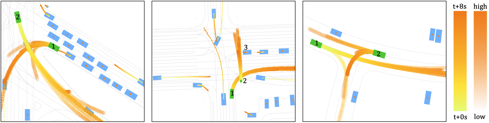
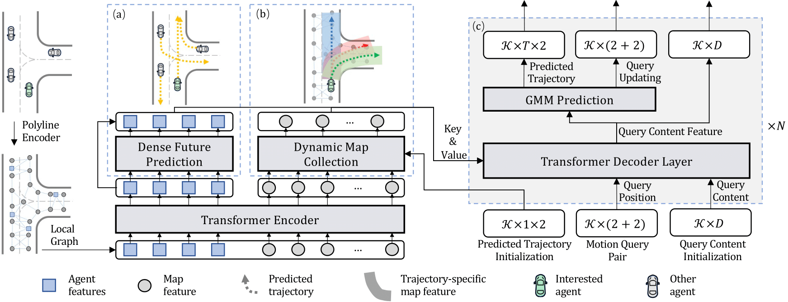

# Motion Transformer (MTR): A Strong Baseline for Multimodal Motion Prediction in Autonomous Driving





This repository is the official implementation of the NeurIPS 2022 paper (oral presentation) ["Motion Transformer with Global Intention Localization and Local Movement Refinement"](https://arxiv.org/abs/2209.13508). 

Authors: Shaoshuai Shi, Li Jiang, Dengxin Dai, Bernt Schiele

[[MTR (arXiv)]](https://arxiv.org/abs/2209.13508) &nbsp;&nbsp;  [[MTR++ (arXiv)]](https://arxiv.org/abs/2306.17770) 

## News
[2023-06] The formal paper of [`MTR++`](https://arxiv.org/abs/2306.17770) is released to [arXiv:2306.17770](https://arxiv.org/abs/2306.17770), which support multi-agent motion prediction and achieve state-of-the-art performance on Waymo Open Dataset.

[2023-05] [`MTR++`](https://arxiv.org/abs/2306.17770) **won the Championship** of Waymo Open Dataset Motion Prediction Challenge 2023, see the leaderboard [here](https://waymo.com/open/challenges/2023/motion-prediction/).

[2022-06] [`MTR`](https://arxiv.org/abs/2209.10033) **won the Championship** of Waymo Open Dataset Motion Prediction Challenge 2022, see the official post [here](https://waymo.com/open/challenges/). 


## Abstract
Predicting multimodal future behavior of traffic participants is essential for robotic vehicles to make safe decisions. Existing works explore to directly predict future trajectories based on latent features or utilize dense goal candidates to identify agent's destinations, where the former strategy converges slowly since all motion modes are derived from the same feature while the latter strategy has efficiency issue since its performance highly relies on the density of goal candidates. In this paper, we propose the [`Motion TRansformer (MTR)`](https://arxiv.org/abs/2209.13508) framework that models motion prediction as the joint optimization of global intention localization and local movement refinement. Instead of using goal candidates, MTR incorporates spatial intention priors by adopting a small set of learnable motion query pairs. Each motion query pair takes charge of trajectory prediction and refinement for a specific motion mode, which stabilizes the training process and facilitates better multimodal predictions. Experiments show that MTR achieves state-of-the-art performance on both the marginal and joint motion prediction challenges, ranking $1^{st}$ on the leaderbaords of Waymo Open Motion Dataset.


## Highlights

### MTR Codebase

- [x] State-of-the-art performance with clear code structure, easy to be extended
- [x] A very simple context encoder for modeling agent/map relations
- [x] Motion decoder with learnable queries on intention points
- [x] Loss with Gaussian Mixture Model for multimodal motion prediction
- [x] Clear data processing and organization on Waymo Open Motion Dataset
- [x] Local evaluation tool with official Waymo Motion Evaluation API

### Method 
* **Simple**: pure transformer-based context encoder and motion decoder
* **Efficient**: model multimodal future prediction with a small number of learnable intention queries
* **Accurate**: rank 1st place at Waymo Motion Prediction leaderboard (last update: Feb 2023)




## Getting Started

- [Installation](docs/INSTALL.md)

- [Dataset Preparation](docs/DATASET_PREPARATION.md)

- [Training & Evaluation](docs/TRAIN_EVAL.md)


## Main Results

#### Performance on the validation set of Waymo Open Motion Dataset
|  Model  |  Training Set | minADE | minFDE | Miss Rate | mAP |
|---------|----------------|--------|--------|--------|--------|
|[MTR](tools/cfgs/waymo/mtr+20_percent_data.yaml)      | 20%            | 0.6697 | 1.3712 | 0.1668 | 0.3437 |
|[MTR](tools/cfgs/waymo/mtr+100_percent_data.yaml)      | 100%           | 0.6046 | 1.2251 | 0.1366 | 0.4164 |
|MTR-e2e  | 100%           | 0.5160 | 1.0404 | 0.1234 | 0.3245 |


#### Performance on the testing set of Waymo Open Motion Dataset
|  Model  |  Training Set | minADE | minFDE | Miss Rate | mAP |
|---------|----------------|--------|--------|--------|--------|
|[MTR](tools/cfgs/waymo/mtr+100_percent_data.yaml)      | 100%          | 0.6050 | 1.2207 | 0.1351 | 0.4129 |
|MTR-A (ens) | 100%           | 0.5640 | 1.1344 | 0.1160 | 0.4492 |


## Citation
If you find this work useful in your research, please consider cite:
```
@article{shi2022motion,
  title={Motion transformer with global intention localization and local movement refinement},
  author={Shi, Shaoshuai and Jiang, Li and Dai, Dengxin and Schiele, Bernt},
  journal={Advances in Neural Information Processing Systems},
  year={2022}
}

@article{shi2023mtr,
  title={MTR++: Multi-Agent Motion Prediction with Symmetric Scene Modeling and Guided Intention Querying},
  author={Shi, Shaoshuai and Jiang, Li and Dai, Dengxin and Schiele, Bernt},
  journal={arXiv preprint arXiv:2306.17770},
  year={2023}
}

@article{shi2022mtra,
  title={MTR-A: 1st Place Solution for 2022 Waymo Open Dataset Challenge--Motion Prediction},
  author={Shi, Shaoshuai and Jiang, Li and Dai, Dengxin and Schiele, Bernt},
  journal={arXiv preprint arXiv:2209.10033},
  year={2022}
}
```