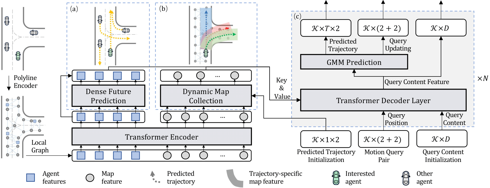

# Motion Transformer with Global Intention Localization and Local Movement Refinement

This repo is for our NeurIPS 2022 paper `"Motion Transformer (MTR)"` for motion prediction in autonomous driving scenarios, and its variant [`MTR-A`](https://arxiv.org/abs/2209.10033) also won the Champion of Motion Prediction Challenge of Waymo Open Dataset Challenge 2022, see the official post [here](https://waymo.com/open/challenges/). 


**Authors**: Shaoshuai Shi, Li Jiang, Dengxin Dai, Bernt Schiele.

[[arXiv]](https://arxiv.org/abs/2209.13508)

## Abstract
Predicting multimodal future behavior of traffic participants is essential for robotic vehicles to make safe decisions. Existing works explore to directly predict future trajectories based on latent features or utilize dense goal candidates to identify agent's destinations, where the former strategy converges slowly since all motion modes are derived from the same feature while the latter strategy has efficiency issue since its performance highly relies on the density of goal candidates. In this paper, we propose the Motion TRansformer (MTR) framework that models motion prediction as the joint optimization of global intention localization and local movement refinement. Instead of using goal candidates, MTR incorporates spatial intention priors by adopting a small set of learnable motion query pairs. Each motion query pair takes charge of trajectory prediction and refinement for a specific motion mode, which stabilizes the training process and facilitates better multimodal predictions. Experiments show that MTR achieves state-of-the-art performance on both the marginal and joint motion prediction challenges, ranking $1^{st}$ on the leaderbaords of Waymo Open Motion Dataset.




## Code 
Code will be released soon. 

## Citation
If you find this work useful in your research, please consider cite:
```
@article{shi2022mtr,
  title={Motion Transformer with Global Intention Localization and Local Movement Refinement},
  author={Shi, Shaoshuai and Jiang, Li and Dai, Dengxin and Schiele, Bernt},
  journal={Advances in Neural Information Processing Systems},
  year={2022}
}
```
